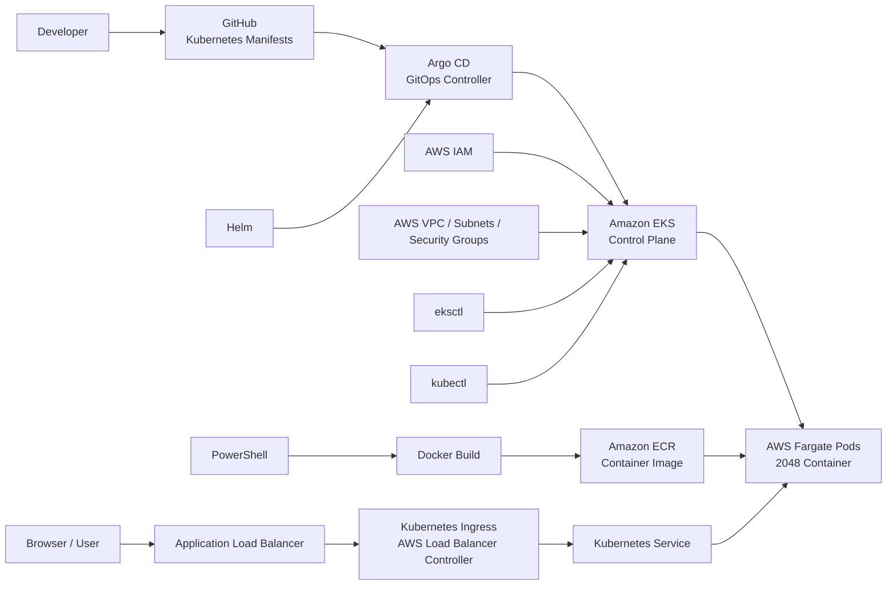

# 2048 Game on AWS EKS with GitOps

A playable 2048 web application deployed on Amazon EKS using AWS Fargate, exposed through an Application Load Balancer, and managed with Argo CD GitOps.

## Architecture



## End-to-End Flow

1. Developer updates Kubernetes manifests in GitHub.
2. Argo CD monitors GitHub and synchronizes the desired state to Amazon EKS.
3. EKS schedules the 2048 workload on AWS Fargate.
4. The application container image is pulled from Amazon ECR.
5. The AWS Load Balancer Controller provisions an Application Load Balancer for the Kubernetes Ingress.
6. Traffic flows: Browser → ALB → Ingress → Kubernetes Service → Fargate Pod.

## Tools and Technologies Used

- Amazon EKS
- AWS Fargate
- Application Load Balancer (ALB)
- AWS Load Balancer Controller
- Amazon ECR
- AWS IAM
- AWS VPC, Subnets and Security Groups
- Kubernetes
- kubectl
- eksctl
- Helm
- Docker
- Argo CD
- GitOps
- GitHub
- PowerShell
- Nginx
- 2048 Web Application
- AWS CloudFormation (used indirectly through eksctl)

## GitOps Architecture

```text
Developer → GitHub → Argo CD → Amazon EKS → Fargate Pods
                                      ↓
                              Kubernetes Service
                                      ↓
                                  ALB Ingress
                                      ↓
                                   Browser

Docker → Amazon ECR → EKS Fargate Pods
```

## Kubernetes Manifests

- `deployment.yaml` — deploys the 2048 container on EKS/Fargate
- `service.yaml` — exposes the application inside the cluster
- `ingress.yaml` — exposes the service through the AWS Application Load Balancer

## Project Highlights

- Serverless Kubernetes compute using AWS Fargate
- GitOps-based continuous synchronization with Argo CD
- Container image management with Amazon ECR
- Internet-facing ALB ingress
- Kubernetes Infrastructure-as-Code stored in GitHub
- Personalized playable 2048 application
